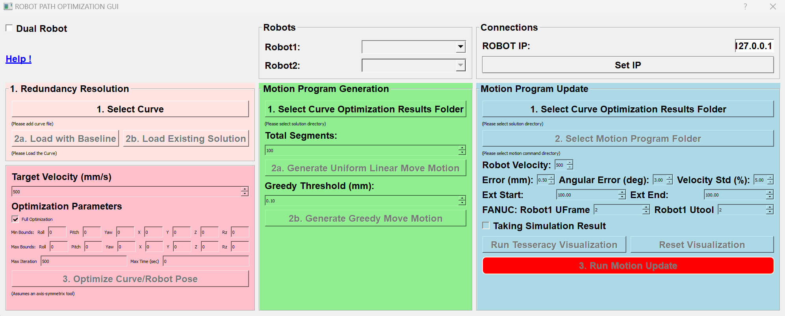

# ARM-21-02-F-19-ROBOT-MOTION-PROGRAM

The repository for ARM project ARM-21-02-F-19-ROBOT-MOTION-PROGRAM

## GUI

The GUI include the whole process of generating and optimizing the motion program, including.
- Solving Redundancy Resolution (left). Determining the curve pose and the joint space trajectory.
- Motion Program Generation (mid). From the curve pose and the joint space trajectory, generate a robot motion program.
- Motion Program Update (right). Update motion program to further optimized it to satisfied requirements.

Please click [here](https://github.com/rpiRobotics/ARM-21-02-F-19-Robot-Motion-Program/tree/main/doc/gui_manual.md) for detail instruction.

Please note that the GUI is an ongoing developed feature. Contact the authors for further questions or requests.

The GUI currently only support FANUC and ABB robot.

## Dependancies
### Robot Drivers:
Robot drivers are python interface with robot controller. Follow instruction on github to install 
* [FANUC Driver](http://github.com/eric565648/fanuc_motion_program_exec)
* [ABB Driver](http://github.com/johnwason/abb_motion_program_exec)
### Other pip packages (install through setup.py)
* PyQt
* Scipy
* qpsolvers

## Data Structure
### Robot
* Robot Definitions: Each robot is stored as a *.yml* file under `/config/<robot_name>_robot_default_config.yml`. If additional robots are needed, simply configure a new yaml file accordingly.
* Robot Acceleration Limit: Robot joint acceleration limits are usually configuration dependant, and those values are determined through simulation environment (RobotStudio, RoboGuide) and stored under `/config/<robot_name>_acc.pickle`.
### Spatial Curve
* `Curve_dense.csv`: 5DOF points in curve frame
* `Curve_in_base_frame.csv`: 5DOF points in robot base frame
* `Curve_js.csv`: 6DOF joint space points in robot base frame
### Transformation
* Tool Center Point (TCP): For single robot case, this is the tool transformation (e.g. `config/paintgun.csv`)
* `curve_pose.csv`: Transformation of curve frame in robot base frame
* `base.csv`: Transformation of second  robot base frame to first robot base frame
* Part Holding Pose: Transformation of the part pose to second robot flange frame
### Command
* `command.csv`, [breakpoints,  primitives, p_bp(breakpoint xyz), q_bp(breakpoint  joint angle)]
* `profile.csv`, dynamic blending  zone and segment velocity

## Max Gradient and Iterative Learning Control (ILC)

FANUC Multi-Peak Max Gradient Descent [Link](https://github.com/rpiRobotics/ARM-21-02-F-19-Robot-Motion-Program/tree/main/ILC)
