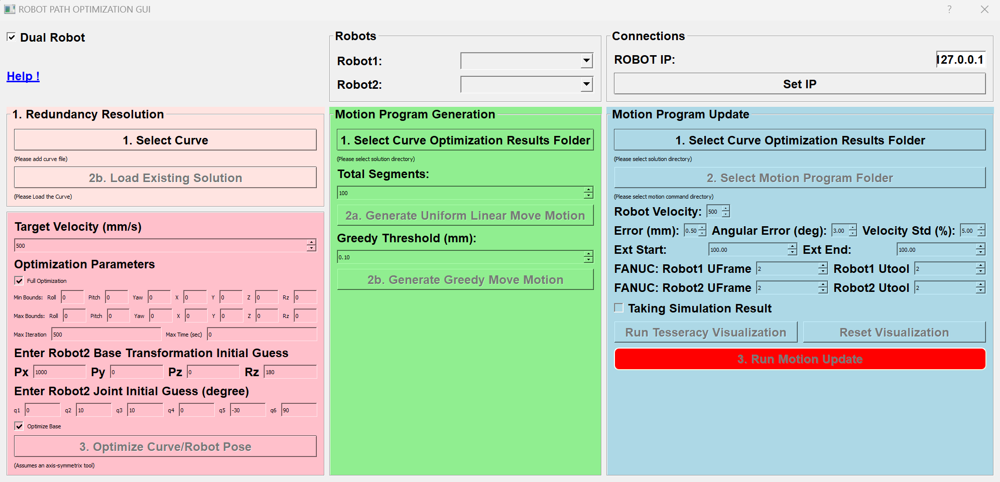

# GUI Dual Arm Manual

The whole process process including three steps, Solving Redundancy Resolution, Motion Program Generation, Motion Program Update. Each step may have multiple algorithms/methods. The feature of allowing user to choose from methods will be added in the future.


<!-- See [here](https://youtu.be/qCv11wtNU88) for video instruction. -->

## Pre-request

A csv file defined the desired curve path (position and normal direction) is requered. The first three columns are position (xyz) and the last three columns are normal direction (xyz). An example file is as followed. Please read [this]() information for more detail.

```
...
1.9316380763831253,0.001054979200265463,25.39999998904546,-0.0,-2.076730708736155e-05,-0.9999999997843596
1.952187417621244,0.001077544961782589,25.39999998857182,-0.0,-2.121151499094843e-05,-0.9999999997750358
1.9727367588593623,0.001100349514426261,25.39999998808298,-0.0,-2.1660423507246714e-05,-0.999999999765413
1.9932861000974806,0.0011233928581964457,25.39999998757862,-0.0,-2.21140326362551e-05,-0.9999999997554847
2.0138354413355986,0.001146674993093109,25.399999987058422,-0.0,-2.2572342377972192e-05,-0.9999999997452446
...
```

## Run Gui

Execute `start.py` in the directory where you saved the repo.

```
cd (repo directory)
python start.py
```

## Choosing Robots and Toggle Dual Arm

On the top box, choose the desired Robot1 and Robot2, set the IP address and click `set IP`. Finally, click the `Dual Robot` check box and you will see the dual arm is enabled.



## Solving Redundancy Resolution

The step finds the optimal Robot2 pose relative to the Robot1 base frame, and the joints trajectories of each arm.

### Baseline

There's no baseline method.

### Differential Evolution

1. Click `Open Curve File` and choose the prepared curve file described in pre-request.
2. Set the aggressive velocity.
3. Set the Robot2 Initial Transformation. If Robot2 pose will be optimized, this will be the inittial guess for the algorithm. Otherwise it will be the final Robot2 pose.
4. Set a initial guess for the first Robot2 joint pose at the first point of the curve.
5. Check if you want to optimize the base or not.
6. Click `Run DiffEvo`.
7. The result will be saved in a folder with the name of both robots. In the folder there will be another folder named with the method (in the case `diffevo`), i.e. `(curve_name)/(Robot1_name)_(Robot2_name)/diffevo/`. The result base pose file `base.csv` and joint trajectory of two arms `Curve_js1.csv`/`Curve_js2.csv` will be saved in the folder. 

Note that differential evolution might take up to 1 days depends on the computaion resource.

## Motion Program Generation

The step generate one motion program for each robot given the curve in joint space file, i.e. `Curve_js1.csv`/`Curve_js2.csv`.

### Baseline

The baseline method simply divided the trajectory into equal distance `Move L` (linear move in cartesian space,in the frame of the curve).

1. Click `Open Solution Directory` and open the previous generated `(curve_name)/(Robot1_name)_(Robot2_name)/diffevo/` folder.
2. Enter how many moveL you want.
3. Click `Run Baseline`
4. The result will be saved in a folder with the name of method (in this case `30L_dual`) and named `command1.csv`/`command2.csv`.


### Greedy

The baseline method simply divided the trajectory into equal distance `Move L` (linear move in  cartesian space).

1. Click `Open Solution Directory` and open the previous generated `(curve_name)/(Robot1_name)_(Robot2_name)/diffevo/` folder.
3. Click `Run Greedy`
4. The result will be saved in a folder with the name of method (in this case `greedy0.2_dual`) and named `command1.csv`/`command2.csv`.

## Motion Program Update

### Multi Max Gradient Descent

1. Click `Open Solution Directory` and open the previous generated folder in redundancy resolution step (e.g. `(curve_name)/(Robot1_name)_(Robot2_name)/diffevo/` folder in step 1).
2. Click `Open Command Directory` and open the previous generated method folder. (e.g. `(curve_name)/(Robot1_name)_(Robot2_name)/diffevo/30L_dual`)
3. Enter the desired velocity, euclidean error/angular error/speed variantion tolerance, and extension length. For FANUC robots, please enter the Utool for the second robot.
4. **!!! Important !!!** For FANUC: Make sure the robot in the roboguide is running (The play key is clicked and turnes green, running the main program. See [here](https://github.com/eric565648/fanuc_motion_program_exec) for further information.)
5. Click `Run Motion Update`
6. While running the program, the result of each iteration will be show in the panel. The result will be saved in a folder `result_speed_(vel)` in the same directory of the motion command profiles.


7. For real robots, the algorithm needs to average the data over N runs to mitigate the noise. Click `Real Robot` button to toggle the function. The real robot result will be saved in `result_speed_(vel)_realrobot`
8. The result includes speed/error plots and updated commands through iterations (`iteration_(x).png`,`command_(x).png`) and the final euclidean error/angular error/speed, speed/error plots commands (`final_error.npy`,`final_ang_error.npy`,`final_speed.npy`,`final_command.csv`,`final_iteration.png`). The final files are the same as the last iteration files.


