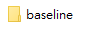
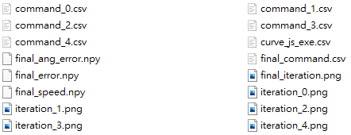

# GUI Manual

The whole process process including three steps, Solving Redundancy Resolution, Motion Program Generation, Motion Program Update. Each step may have multiple algorithms/methods. The feature of allowing user to choose from methods will be added in the future.


<!-- See [here](https://youtu.be/qCv11wtNU88) for video instruction. -->

## Pre-request

A csv file defined the desired curve path (position and normal direction) is requered. The first three columns are position (xyz) and the last three columns are normal direction (xyz). An example file is as followed.

```
...
1.9316380763831253,0.001054979200265463,25.39999998904546,-0.0,-2.076730708736155e-05,-0.9999999997843596
1.952187417621244,0.001077544961782589,25.39999998857182,-0.0,-2.121151499094843e-05,-0.9999999997750358
1.9727367588593623,0.001100349514426261,25.39999998808298,-0.0,-2.1660423507246714e-05,-0.999999999765413
1.9932861000974806,0.0011233928581964457,25.39999998757862,-0.0,-2.21140326362551e-05,-0.9999999997554847
2.0138354413355986,0.001146674993093109,25.399999987058422,-0.0,-2.2572342377972192e-05,-0.9999999997452446
...
```

## Run Gui

Execute `start.py` in the directory where you saved the repo.

```
cd (repo directory)
python start.py
```

## Solving Redundancy Resolution

The step finds the optimal curve pose (relative to the robot base frame), the curve represented in base frame and the curve in joint space (joints trajectories).

### Baseline

0. Choose Robot1
1. Click `Open Curve File` and choose the prepared curve file described in pre-request.
2. Click `Run Baseline`.
3. The result will be saved in a folder named `(robot name)` in the same directory of the curve file. 


4. In the result folder, the result will be saved in the folder with the method name (`baseline` in this case). The result includeing the curve pose (`blade_pose.yaml`), the curve represented in base frame (`Curve_in_base_frame.csv`) and the curve in joint space (`Curve_js.csv`) will be saved in this `baseline` folder




### Differential Evolution

0. Choose Robot1
1. Click `Open Curve File` and choose the prepared curve file described in pre-request.
2. Click `Run DiffEvo`.
3. In the result folder, the result will be saved in the folder with the method name. The result includeing the curve pose (`blade_pose.yaml`), the curve represented in base frame (`Curve_in_base_frame.csv`) and the curve in joint space (`Curve_js.csv`) will be saved in this `baseline` folder 

Note that differential evolution might take up to 1 days depends on the computaion resource.

## Motion Program Generation

The step generate a motion program given the curve in joint space file.

### Baseline

The baseline method simply divided the trajectory into equal distance `Move L` (linear move in  cartesian space).

0. Choose Robot1
1. Click `Open Curve Js File` and open the previous generated `Curve_js.csv`.
2. Enter how many moveL you want.
3. Click `Run Baseline`
4. The result will be saved in a folder with the name of method (in this case `25L`) and named `command.csv`.


### Greedy

The baseline method simply divided the trajectory into equal distance `Move L` (linear move in  cartesian space).

0. Choose Robot1
1. Click `Open Curve Js File` and open the previous generated `Curve_js.csv`.
2. Enter the greedy fit tolerance.
3. Click `Run Baseline`
4. The result will be saved in a folder with the name of method (in this case `greedy0.1`) and named `command.csv`.

## Motion Program Update

### Multi Max Gradient Descent

0. Choose Robot1
1. Click `Open Solution Directory` and open the previous generated folder in redundancy resolution step (e.g. the `baseline` folder in step 1).
2. Click `Open Command File` and open the previous generated `command.csv`. (e.g. `baseline/25L/command.csv`)
3. Enter the desired velocity, euclidean error/angular error/speed variantion tolerance, and extension length.
4. **!!! Important !!!** For FANUC: Make sure the robot in the roboguide is running (The play key is clicked and turnes green, running the main program. See [here](https://github.com/eric565648/fanuc_motion_program_exec) for further information.)
5. Click `Run Motion Update`
7. While running the program, the result of each iteration will be show in the panel. The result will be saved in a folder `result_speed_(vel)` in the same directory of the motion command profile `command.csv`.


8. The result includes speed/error plots and updated commands through iterations (`iteration_(x).png`,`command_(x).png`) and the final euclidean error/angular error/speed, speed/error plots commands (`final_error.npy`,`final_ang_error.npy`,`final_speed.npy`,`final_command.csv`,`final_iteration.png`). The final files are the same as the last iteration files.



